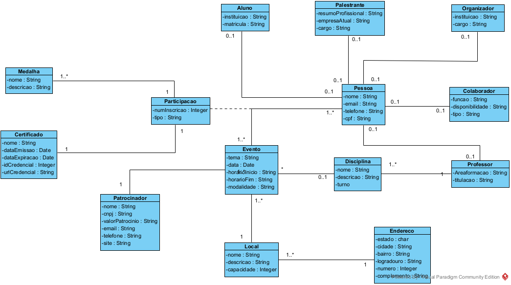
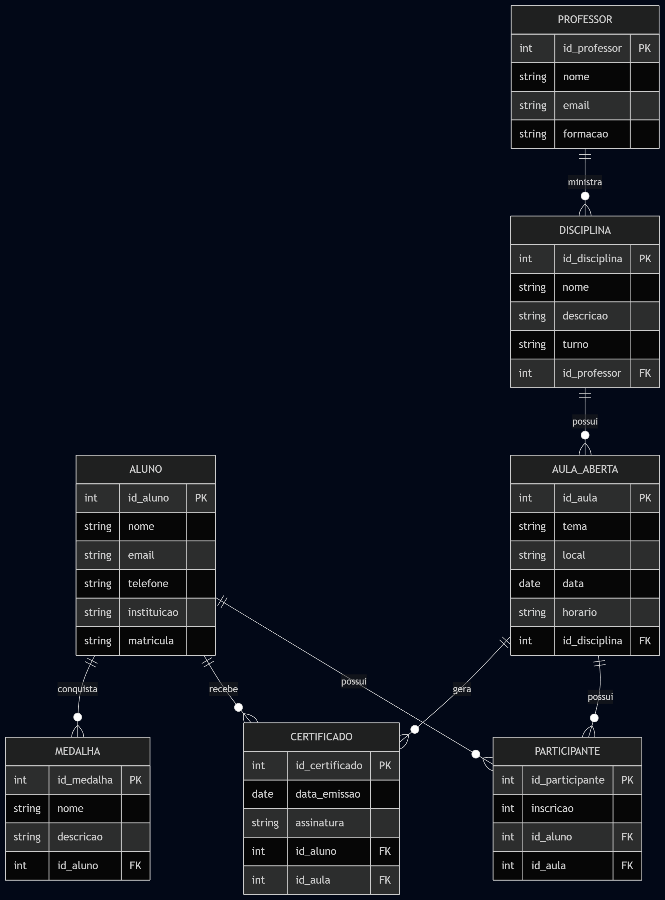
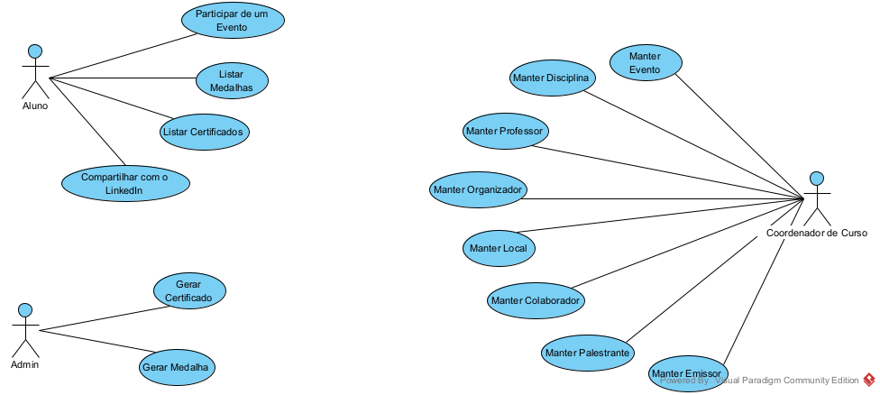

<h1 align="center">Muttley</h1>

  
  
  
  
  

---

Interface Web para gerenciamento de eventos da Fatec Zona Leste, controlando inscrições, QR codes para inscrição, geração de certificados, envio de e-mails e conexão com LinkedIn.

## Índice

- [Descrição](#descrição)
- [Funcionalidades](#funcionalidades)
- [Tecnologias](#tecnologias)
- [Estrutura do Projeto](#estrutura-do-projeto)
- [Padrões de Projeto Utilizados](#padrões-de-projeto-utilizados)
- [Diagramas](#diagramas)
- [Pré-requisitos](#pré-requisitos)
- [Equipe de Desenvolvimento](#equipe-de-desenvolvimento)
- [Licença](#-licença)

---

## Descrição

O **App** tem como objetivo facilitar o controle das informações dos eventos da faculdade, permitindo o cadastro e gerenciamento de entidades do domínio (como Evento, Certificado, Participação, Pessoa), geração de certificados em PDF para cada evento, QR codes para realizar inscrições e envio de e-mails para os participantes, centralizando as funcionalidades necessárias em um único local.

## Funcionalidades

Funcionalidades implementadas:

- Cadastro e manutenção de pessoas
- Cadastro e manutenção de papéis (ex.: aluno, palestrante, organizador)
- Cadastro e manutenção de locais para evento
- Cadastro e manutenção de patrocinadores de evento
- Cadastro e manutenção de disciplinas relacionadas a professores
- Cadastro e manutenção de eventos da faculdade
- Conexão com LinkedIn para adicionar certificados ao perfil
- Definição de certificados únicos para cada papel
- Envio de e-mails para participantes com informações do evento
- Geração de medalhas relacionadas a eventos
- Geração e download de certificados em PDF
- Geração de QR codes para realizar inscrições

## Tecnologias

- **Linguagem:** Java 21
- **Paradigma:** Programação orientada a objetos
- **Build/Dependência:** Maven
- **Banco de Dados:** MySQL
- **UI:** HTML5 e CSS3

## Estrutura do Projeto

Estrutura construída seguindo os princípios de uma arquitetura em camadas com Spring-Boot:

- `Entities - @Entity`: são as entidades de domínio da aplicação.
- `Controllers - @Controller`: são os controllers que se conectam e gerenciam as telas do sistema.
- `Services - @Service`: são as classes de serviço, que contém as funcionalidades específicas do sistema para cada entidade.
- `Repositories - @Repository`: classes para conexão/comunicação com o banco de dados.
- `Mappers - @Mapper`: classes para transformar entidades em DTOs.
- `DTOs - Data Transfer Object`: records para transferência de dados entre partes do sistema.
- `Resources`: arquivos de configuração e estrutura de telas do sistema.

## Padrões de Projeto Utilizados

- **Entity Pattern** para criação das entidades.
- **Controller Pattern** para intermediar a UI e a lógica de negócio.
- **Service Pattern** para encapsular diferentes regras de negócio.
- **Repository Pattern** para abstração de banco de dados.

Esses padrões garantem flexibilidade, testabilidade e baixo acoplamento.

## Diagramas

Abaixo estão os principais diagramas que representam a arquitetura e o fluxo da aplicação:

### 1. Diagrama de Classes

### 2. Diagrama de Entidade-Relacionamento

### 3. Diagrama de Caso de Uso

## Pré-requisitos

- **Java 21** instalado e configurado (`JAVA_HOME` e PATH)
- Ferramenta de build:
  - Maven

---
## Equipe de Desenvolvimento

Este projeto está sendo construído com dedicação por desenvolvedores comprometidos com qualidade, boas práticas e arquitetura limpa. Cada membro contribuiu com perspectivas diferentes que elevaram o nível do produto.

### Autores

| Nome                 | Função no Projeto                                                         | GitHub                                                       | LinkedIn     
|----------------------|---------------------------------------------------------------------------|--------------------------------------------------------------|--------------------------------------|
| **André Lamego**     | Desenvolvimento backend, frontend, integrações, testes e otimização       | [github.com/andrelamego](https://github.com/andrelamego)     |[linkedin.com/andre-oliveira-lamego/](https://www.linkedin.com/in/andre-oliveira-lamego/) |
| **Bruno Hiroshi**    | Desenvolvimento backend, frontend, APIs para e-mail e QR codes            | [github.com/Bruno-Hiroshi](https://github.com/Bruno-Hiroshi) |[linkedin.com/brunovigeta/](https://www.linkedin.com/in/brunovigeta/) |
| **Gabriel de Negri** | Desenvolvimento backend, frontend, arquitetura e projeção, geração de pdf | [github.com/Bielnegri](https://github.com/Bielnegri)         |[linkedin.com/gabriel-benedito-de-negri/](https://www.linkedin.com/in/gabriel-benedito-de-negri/) |
| **João Pedro Leme Hernandez Fernandez**  | Desenvolvimento backend, frontend, arquitetura, testes e diagramação      | [github.com/jplhfernandez](https://github.com/jplhfernandez) | [linkedin.com/joaopedrolemehernandezfernandez/](https://www.linkedin.com/in/joaopedrolemehernandezfernandez/) |

## 📄 Licença
Este projeto está licenciado sob os termos de uma **Licença Proprietária**.  
Consulte o arquivo [LICENSE](./LICENSE) para mais informações.
