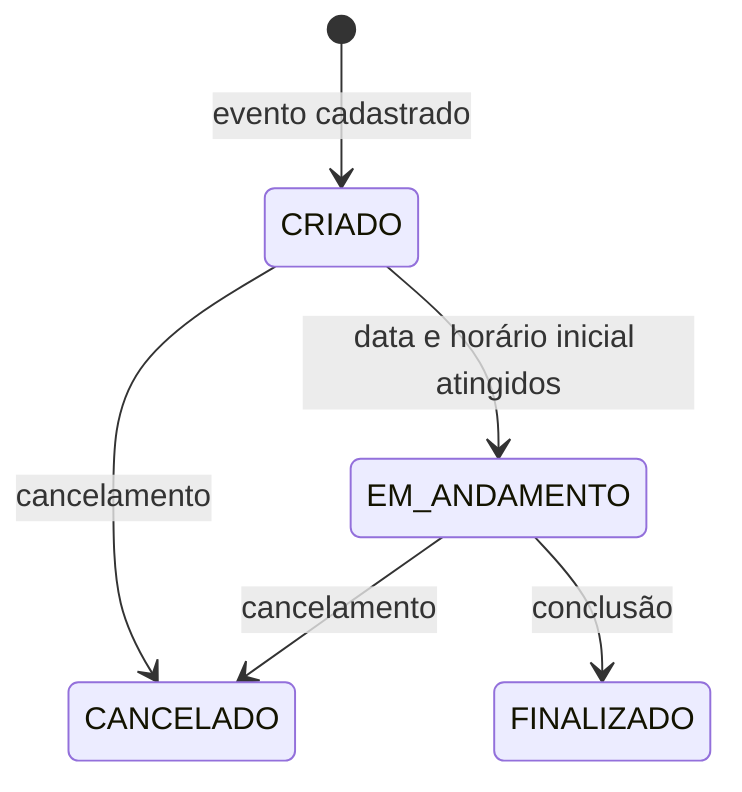
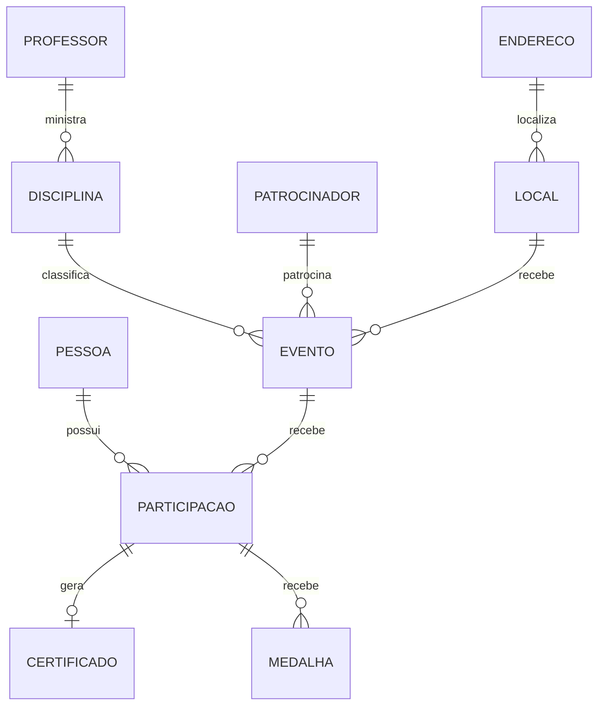

# Muttley - Requisitos e Regras de Negócio

## 1. Sobre o sistema

O Muttley é uma plataforma para gestão de eventos acadêmicos da FATEC. O sistema permite:

- divulgar eventos e receber inscrições públicas;
- administrar eventos, participantes e presença;
- emitir certificados;
- conceder medalhas;
- enviar notificações por email;
- gerar QR Codes de inscrição e confirmação de presença;
- disponibilizar uma área pessoal para cada usuário.

Para a estratégia de validação destes requisitos, consulte o
[Guia de Implementação de Testes](./guia-de-testes.md).

## 2. Perfis de acesso

### Visitante

Não precisa estar autenticado. Pode:

- consultar eventos disponíveis;
- visualizar detalhes de um evento;
- realizar uma inscrição;
- confirmar presença;
- consultar, visualizar e baixar certificados públicos.

### Usuário

Possui a role `USER`. Além das ações públicas, pode:

- consultar seus dados;
- consultar suas participações;
- consultar seus certificados;
- consultar suas medalhas.

### Administrador

Possui a role `ADMIN`. Pode:

- acessar o painel administrativo;
- gerenciar eventos e participações;
- gerenciar pessoas e cadastros auxiliares;
- concluir e cancelar eventos;
- emitir certificados;
- conceder medalhas;
- consultar estatísticas.

## 3. Controle de acesso

| Recurso | Visitante | USER | ADMIN |
|---|:---:|:---:|:---:|
| Cadastro e login | Sim | Sim | Sim |
| Consulta pública de eventos | Sim | Sim | Sim |
| Inscrição em evento | Sim | Sim | Sim |
| Confirmação de presença | Sim | Sim | Sim |
| Consulta pública de certificado | Sim | Sim | Sim |
| Área `/api/me/**` | Não | Sim | Sim |
| Recursos `/api/admin/**` | Não | Não | Sim |
| Recursos autenticados restantes | Não | Sim | Sim |

Todas as sessões são stateless. A autenticação utiliza Bearer Token JWT.

## 4. Pessoas e autenticação

### Requisitos funcionais

- **RF-AUT-01:** cadastrar usuário com nome, email, telefone, CPF e senha.
- **RF-AUT-02:** autenticar usuário por email e senha.
- **RF-AUT-03:** emitir JWT após autenticação válida.
- **RF-AUT-04:** permitir que uma pessoa criada durante uma inscrição complete seu cadastro.
- **RF-AUT-05:** permitir ao usuário consultar seus próprios dados.
- **RF-PES-01:** permitir ao administrador listar, consultar, criar, atualizar e excluir pessoas.
- **RF-PES-02:** permitir ao administrador listar pessoas por perfil.

### Regras de negócio

- **RN-AUT-01:** o email deve ser único.
- **RN-AUT-02:** a senha deve ser armazenada com BCrypt.
- **RN-AUT-03:** a senha nunca deve ser retornada pela API.
- **RN-AUT-04:** o primeiro usuário cadastrado recebe role `ADMIN`.
- **RN-AUT-05:** os demais usuários cadastrados recebem role `USER`.
- **RN-AUT-06:** credenciais inválidas retornam `401 Unauthorized`.
- **RN-AUT-07:** o JWT deve conter email, ID do usuário, role, emissão e expiração.
- **RN-AUT-08:** a duração padrão do JWT é de duas horas.
- **RN-AUT-09:** um cadastro incompleto só pode ser completado uma vez.
- **RN-AUT-10:** tentativa de completar um cadastro já finalizado retorna `409 Conflict`.
- **RN-PES-01:** cadastro completo exige nome, email válido, telefone, CPF válido e senha.
- **RN-PES-02:** uma pessoa pode possuir perfis especializados de aluno, professor, palestrante, organizador ou colaborador.

### Dados do usuário autenticado

| Rota | Descrição |
|---|---|
| `GET /api/me` | Dados pessoais do usuário autenticado. |
| `GET /api/me/participacoes` | Participações vinculadas ao usuário. |
| `GET /api/me/certificados` | Certificados vinculados ao usuário. |
| `GET /api/me/medalhas` | Medalhas vinculadas ao usuário. |

## 5. Eventos

### Requisitos funcionais

- **RF-EVT-01:** listar eventos disponíveis para inscrição.
- **RF-EVT-02:** exibir detalhes públicos do evento.
- **RF-EVT-03:** permitir ao administrador criar eventos.
- **RF-EVT-04:** permitir ao administrador atualizar eventos.
- **RF-EVT-05:** permitir ao administrador cancelar eventos.
- **RF-EVT-06:** permitir ao administrador concluir eventos.
- **RF-EVT-07:** listar eventos administrativos com busca, filtro, ordenação e paginação.
- **RF-EVT-08:** consultar as participações de um evento.
- **RF-EVT-09:** gerar e baixar QR Codes de inscrição e confirmação.

### Dados obrigatórios

Um evento deve possuir:

- tema;
- descrição;
- data;
- horário inicial;
- horário final;
- modalidade;
- disciplina;
- patrocinador;
- local.

### Estados do evento



### Regras de negócio

- **RN-EVT-01:** todo evento novo inicia como `CRIADO`.
- **RN-EVT-02:** a data informada não pode estar no passado.
- **RN-EVT-03:** horários devem utilizar o formato `HH:mm`.
- **RN-EVT-04:** o horário final deve ser posterior ao horário inicial.
- **RN-EVT-05:** disciplina, patrocinador e local devem existir.
- **RN-EVT-06:** evento `FINALIZADO` não pode ser atualizado.
- **RN-EVT-07:** evento `FINALIZADO` não pode ser cancelado.
- **RN-EVT-08:** evento `CANCELADO` não pode ser cancelado novamente.
- **RN-EVT-09:** somente evento `EM_ANDAMENTO` pode ser concluído.
- **RN-EVT-10:** evento `CRIADO` passa para `EM_ANDAMENTO` após atingir sua data e horário inicial.
- **RN-EVT-11:** somente eventos `CRIADO` são exibidos como disponíveis para inscrição.
- **RN-EVT-12:** eventos cancelados não aparecem na listagem administrativa padrão.
- **RN-EVT-13:** cancelamento envia notificação a todos os inscritos.
- **RN-EVT-14:** criação solicita a geração dos QR Codes de inscrição e confirmação.

### Conclusão do evento

A conclusão utiliza:

```http
POST /api/admin/eventos/{id}/concluir
Content-Type: multipart/form-data
```

Parâmetros:

| Campo | Obrigatório | Descrição |
|---|:---:|---|
| `file` | Sim | Imagem da assinatura usada nos certificados. |
| `presentes` | Não | IDs das participações presentes. |

Ao concluir um evento, o sistema deve:

1. validar que o evento está `EM_ANDAMENTO`;
2. salvar a imagem da assinatura;
3. marcar as participações válidas como presentes;
4. gerar medalhas de bronze para os presentes;
5. gerar certificados para os presentes ainda não certificados;
6. alterar o evento para `FINALIZADO`;
7. notificar os inscritos sobre a conclusão;
8. enviar os certificados recém-gerados por email.

IDs de participação que não pertencem ao evento são ignorados.

## 6. Inscrições e participações

### Requisitos funcionais

- **RF-PAR-01:** permitir inscrição pública sem autenticação.
- **RF-PAR-02:** receber nome completo, CPF e email na inscrição.
- **RF-PAR-03:** permitir consulta das participações do usuário autenticado.
- **RF-PAR-04:** permitir confirmação pública de presença.
- **RF-PAR-05:** permitir gestão autenticada de participações.

### Regras de negócio

- **RN-PAR-01:** inscrição só é permitida em evento `CRIADO` e ainda não iniciado.
- **RN-PAR-02:** o sistema deve procurar uma pessoa existente por CPF e email.
- **RN-PAR-03:** uma pessoa existente deve ser reutilizada.
- **RN-PAR-04:** se CPF e email pertencerem a pessoas diferentes, retornar `409 Conflict`.
- **RN-PAR-05:** uma pessoa não pode se inscrever duas vezes no mesmo evento.
- **RN-PAR-06:** pessoa criada pela inscrição recebe role `USER`.
- **RN-PAR-07:** os campos não informados da pessoa podem permanecer nulos.
- **RN-PAR-08:** o número da inscrição é gerado sequencialmente.
- **RN-PAR-09:** o tipo padrão é `Participante`.
- **RN-PAR-10:** uma inscrição bem-sucedida envia email de confirmação.
- **RN-PAR-11:** pessoa sem senha também recebe email para completar cadastro.
- **RN-PAR-12:** uma participação deve estar vinculada a uma pessoa e a um evento.

### Confirmação de presença

```http
POST /api/eventos/{eventoId}/confirmar-presenca/{cpf}
```

- o CPF deve ser válido;
- a pessoa deve existir;
- a pessoa deve estar inscrita no evento;
- a presença não pode ter sido confirmada anteriormente;
- a participação deve ser marcada como presente;
- uma medalha de bronze deve ser gerada.

Confirmação repetida retorna `409 Conflict`.

## 7. Certificados

### Requisitos funcionais

- **RF-CER-01:** gerar certificados para participantes presentes.
- **RF-CER-02:** listar certificados administrativamente.
- **RF-CER-03:** consultar certificado publicamente por código.
- **RF-CER-04:** visualizar certificado em PDF no navegador.
- **RF-CER-05:** baixar certificado em PDF.
- **RF-CER-06:** vincular assinatura a um certificado.
- **RF-CER-07:** vincular assinatura a todos os certificados de um evento.
- **RF-CER-08:** listar certificados do usuário autenticado.
- **RF-CER-09:** fornecer URL de compartilhamento no LinkedIn.

### Regras de negócio

- **RN-CER-01:** deve existir no máximo um certificado automático por participação.
- **RN-CER-02:** participação já certificada é ignorada durante geração em lote.
- **RN-CER-03:** certificado automático usa a data atual.
- **RN-CER-04:** certificado automático usa a assinatura textual `Coordenação FATEC`.
- **RN-CER-05:** cada certificado possui código UUID único.
- **RN-CER-06:** código, URL pública e caminho do PDF são preenchidos automaticamente.
- **RN-CER-07:** a data de emissão manual não pode ser futura.
- **RN-CER-08:** o preview retorna PDF com disposição `inline`.
- **RN-CER-09:** o download retorna PDF com disposição `attachment`.
- **RN-CER-10:** a assinatura visual é incorporada ao PDF.
- **RN-CER-11:** somente certificados recém-gerados são publicados para envio por email.
- **RN-CER-12:** a carga horária é calculada pela diferença entre início e fim do evento.

### Rotas públicas

| Rota | Resultado |
|---|---|
| `GET /api/certificados/{codigo}` | Dados e URL do LinkedIn. |
| `GET /api/certificados/{codigo}/preview` | PDF inline. |
| `GET /api/certificados/{codigo}/download` | Download do PDF. |

## 8. Medalhas

### Requisitos funcionais

- **RF-MED-01:** permitir ao administrador criar, consultar, atualizar e excluir medalhas.
- **RF-MED-02:** permitir ao usuário consultar suas medalhas.
- **RF-MED-03:** gerar medalha automaticamente após confirmação de presença.

### Regras de negócio

- **RN-MED-01:** medalha deve possuir nome, descrição, tipo e participação.
- **RN-MED-02:** tipos válidos são `BRONZE`, `PRATA` e `OURO`.
- **RN-MED-03:** o tipo padrão é `BRONZE`.
- **RN-MED-04:** participação precisa estar presente para receber bronze automático.
- **RN-MED-05:** não deve existir mais de uma medalha bronze automática para a mesma participação.
- **RN-MED-06:** administrador pode conceder medalhas adicionais.

## 9. Cadastros auxiliares

Os recursos abaixo são administrados por usuários `ADMIN`.

| Recurso | Dados e regras principais |
|---|---|
| Endereço | Estado, cidade, bairro, logradouro, número e complemento obrigatórios. |
| Local | Nome, descrição, capacidade e endereço existente. |
| Disciplina | Nome, descrição e turno; professor opcional, mas válido quando informado. |
| Patrocinador | Nome, CNPJ, valor, email, telefone e site. |
| Aluno | Instituição e matrícula. |
| Professor | Área de formação e titulação. |
| Palestrante | Resumo profissional, empresa e cargo. |
| Organizador | Instituição e cargo. |
| Colaborador | Função, disponibilidade e tipo. |

## 10. Integrações

### Emails

As notificações são publicadas no Kafka.

| Acontecimento | Tópico |
|---|---|
| Inscrição confirmada | `email.inscricao.confirmada` |
| Completar cadastro | `email.completar.cadastro` |
| Evento cancelado | `email.evento.cancelado` |
| Evento concluído | `email.evento.concluido` |
| Certificado emitido | `email.certificado` |

### QR Codes

- criação de evento solicita QR Codes de inscrição e confirmação;
- solicitações são publicadas em `qrcode.gerar.request`;
- respostas são consumidas de `qrcode.gerar.response`;
- resposta bem-sucedida atualiza a URL correspondente no evento;
- resposta com erro não altera o evento.

### PDF

- o HTML do certificado é processado pelo backend;
- a geração do PDF é delegada ao serviço configurado em `pdf.ms-url`;
- o serviço deve retornar os bytes do PDF.

## 11. Painel administrativo

O painel deve apresentar:

- próximos eventos ativos;
- eventos com maior número de certificados;
- participantes com maior número de medalhas;
- certificados emitidos nos últimos 30 dias;
- variação em relação aos 30 dias anteriores;
- quantidade de eventos ativos;
- quantidade de eventos ativos nos próximos sete dias.

Quando o período anterior não possui certificados:

- a variação é `100%` se o período atual possuir certificados;
- a variação é `0%` se ambos forem zero.

## 12. Respostas de erro

| Situação | Status esperado |
|---|:---:|
| Recurso inexistente | `404` |
| Dados inválidos | `400` |
| Credenciais inválidas | `401` |
| Token ausente ou inválido | `401` |
| USER acessando rota administrativa | `403` |
| Recurso duplicado ou conflito de estado | `409` |
| Falha inesperada | `500` |

Erros de validação retornam a lista dos campos inválidos na propriedade `erros`.

## 13. Pontos que precisam de decisão

Os itens abaixo possuem comportamento ambíguo ou proteção insuficiente e devem ser definidos antes de serem tratados como regra permanente:

1. CPF ainda não possui restrição única no banco.
2. CPF da inscrição pública não utiliza a mesma validação do cadastro completo.
3. Número de inscrição usa `maior número + 1`, sujeito a concorrência.
4. Capacidade do local não limita inscrições.
5. Evento online também exige local.
6. Evento cancelado ainda pode ser atualizado.
7. Rotas de CRUD de participação podem ser acessadas por qualquer usuário autenticado.
8. Arquivos de assinatura não possuem validação de tamanho e MIME type.
9. Certificado único por participação não possui constraint no banco.
10. Medalha bronze única não possui constraint no banco.
11. Erros de estado podem resultar em `500` por falta de tratamento global.
12. A atualização de evento precisa definir claramente se o ID válido é o da URL ou o do corpo.

## 14. Modelo de dados resumido


